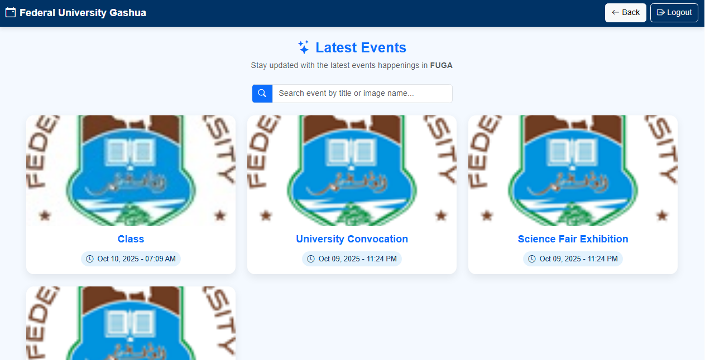

# 🖼️ Image Gallery Application

A responsive image gallery with search and lightbox display.

---

## 🧠 Tech Stack
HTML | CSS | JavaScript

---

## ✨ Features
- Grid-based responsive gallery
- Search/filter images by title or tag
- Click to view larger image (lightbox)
- Lazy loading for images (if implemented)

---

## ⚙️ How to Run
1. Clone the repo.
2. Open `index.html` in your browser.
3. Add images to `/images` and update `data` array or markup.

---

## 📸 Screenshots

---

## 🚀 Live Demo
`#TODO` (if using GitHub Pages)

## 📄 License
Portfolio / demo.
